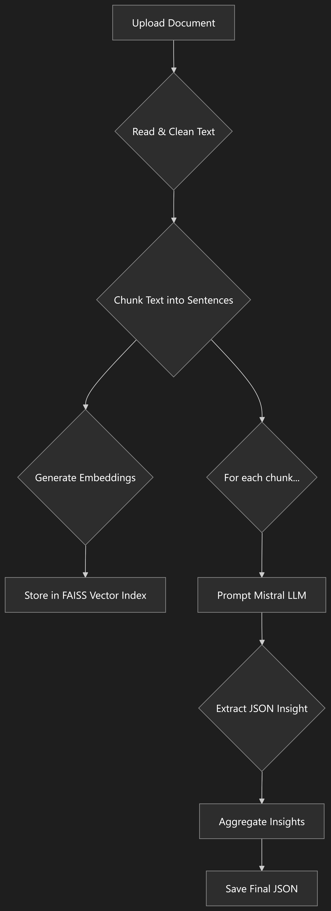

# Advanced RAG-based Persona Extraction API

This project is a sophisticated FastAPI application that leverages a Retrieval-Augmented Generation (RAG) pipeline to extract structured insights (personas, pain points, and goals) from unstructured text documents (`.docx`, `.pdf`).

The system is built with a modular architecture and features an advanced, fine-tuned embedding model and a high-performance FAISS vector store for efficient, context-aware information extraction.

## Key Features

- **FastAPI Backend:** A robust and scalable API server.
- **Modular Architecture:** Code is organized into logical components for configuration, logging, preprocessing, vectorization, and LLM interaction.
- **Advanced RAG Pipeline:** Uses a fine-tuned `all-mpnet-base-v2` model to generate semantically rich embeddings and retrieves relevant context from a FAISS vector store to enhance LLM extraction accuracy.
- **Optimized Vector Search:** Implements `IndexIVFFlat` from FAISS for fast and scalable similarity searches.
- **Prompt Engineering:** Utilizes fine-tuned prompts with few-shot examples to guide the LLM towards extracting specific, professional job titles as personas.
- **Performance Benchmarking:** Includes scripts to evaluate and compare different model and chunking strategies.

## System Architecture

The following diagram illustrates the end-to-end workflow of the application, from document upload to structured data extraction.



## Setup and Installation

1.  **Clone the repository:**
    ```bash
    git clone <your-repository-url>
    cd <repository-name>
    ```

2.  **Create and activate a virtual environment:**
    ```bash
    python -m venv venv
    # On Windows
    venv\Scripts\activate
    # On macOS/Linux
    source venv/bin/activate
    ```

3.  **Install the required dependencies:**
    ```bash
    pip install -r requirements.txt
    ```

4.  **Configure Environment Variables:**
    Create a `.env` file in the root directory and add your Mistral API key:
    ```
    MISTRAL_API_KEY="your_mistral_api_key_here"
    ```

## How to Run

To start the FastAPI application, run the following command from the root directory:

```bash
uvicorn main:app --reload
```

The API will be available at `http://127.0.0.1:8000/docs` where you can access the Swagger UI for interactive testing.

## Benchmarking & Evaluation

This project includes comprehensive scripts for evaluating the performance of the embedding models and the overall RAG pipeline.

### Embedding Model Evaluation

The `evaluate_model.py` script compares the performance of the base `all-mpnet-base-v2` model against our fine-tuned version. Fine-tuning significantly improves the model's ability to understand the semantic nuances of the domain-specific documents.

The results clearly demonstrate the significant improvement gained from fine-tuning the embedding model on a domain-specific corpus:

| Model | Cosine Similarity Score |
| :--- | :--- |
| **Base Model** | `0.68` |
| **Fine-Tuned Model** | `0.82` |

### RAG Pipeline Performance

The following graphs, generated from benchmark tests, illustrate the performance comparison between different RAG model configurations.

#### Model Performance Score Comparison

This chart shows the accuracy score for each model configuration. Higher scores indicate better performance in extracting relevant and accurate information.


#### Model Processing Time Comparison

This chart compares the processing time (in seconds) required by each model to analyze a sample document. Lower times indicate better efficiency.

